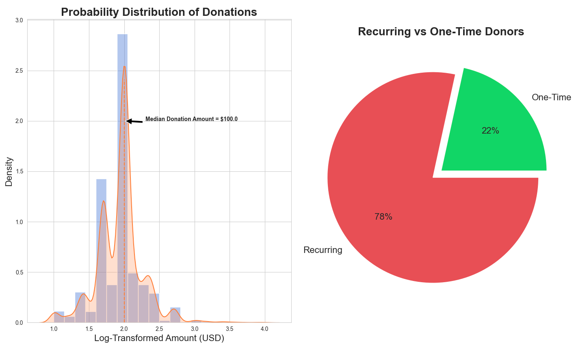
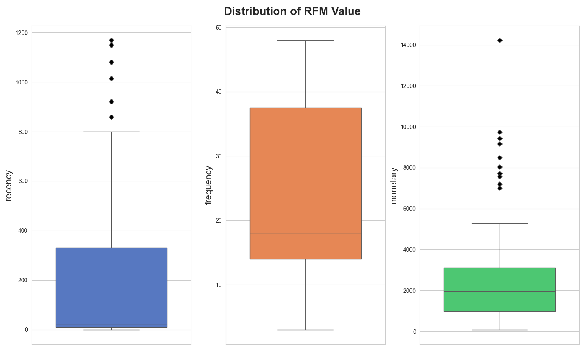
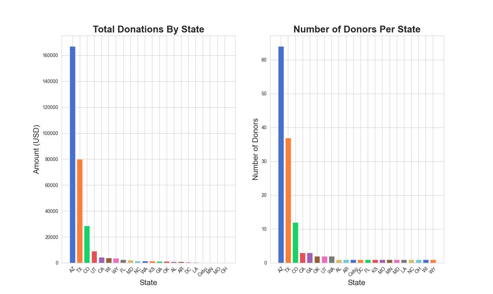
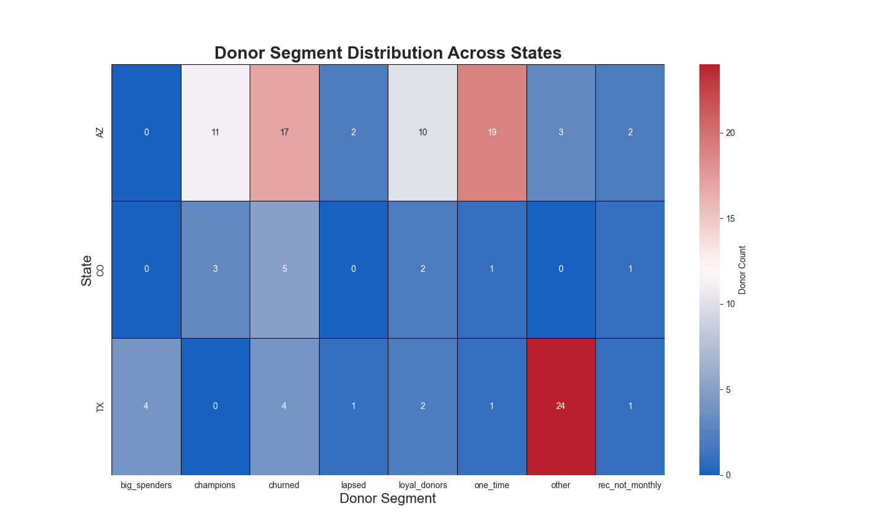
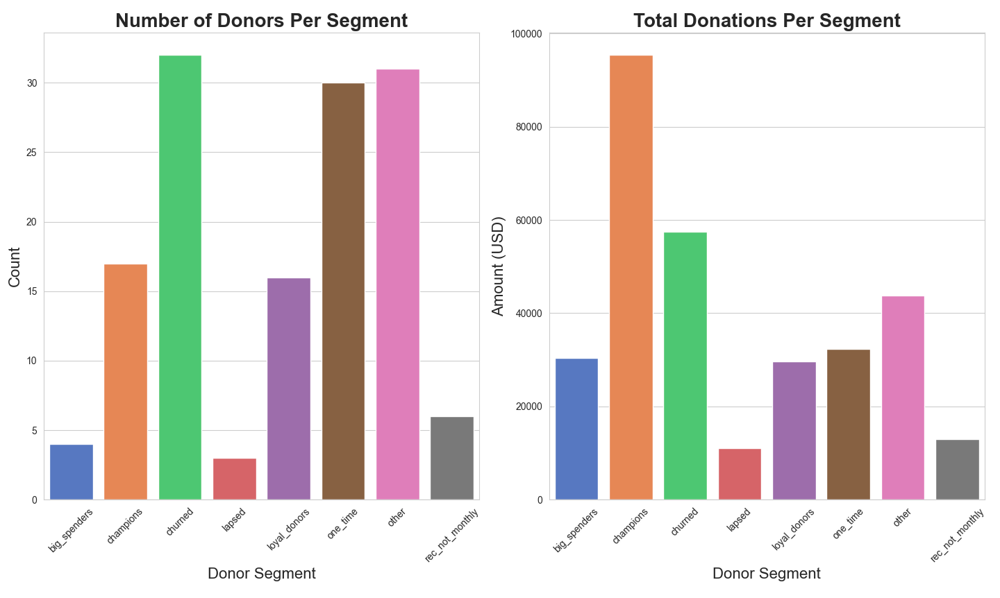
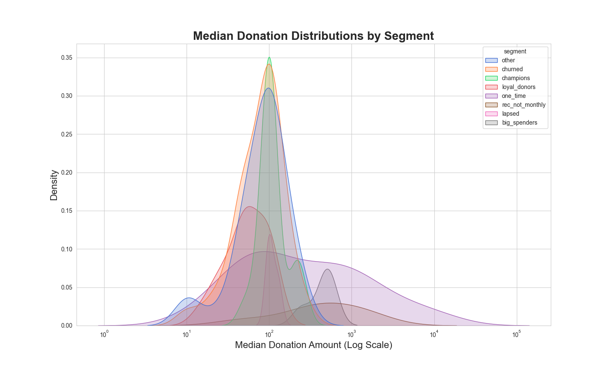
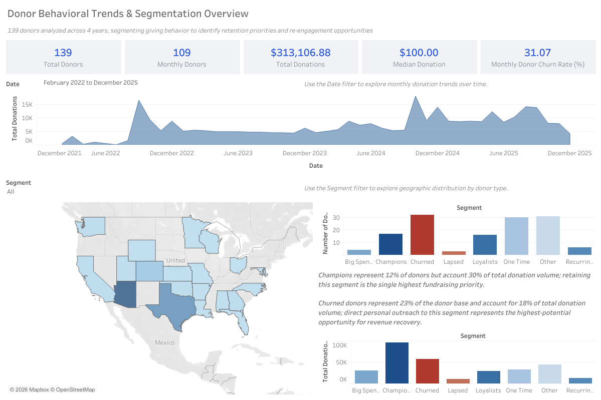

# 🎗️ Donor Behavior Analytics & Revenue Stability Assessment

A full end-to-end data analytics project covering data cleaning, deduplication, feature engineering, RFM segmentation, and interactive Tableau dashboards — applied to the donor base of Tokyo Student Mobilization, Inc. Built to support strategic retention, re-engagement, and geographically informed fundraising decisions.

---

## 📋 Table of Contents

- [Project Overview](#project-overview)
- [Business Context & Impact](#business-context--impact)
- [Tech Stack](#tech-stack)
- [Project Architecture](#project-architecture)
- [Key Metrics & Findings](#key-metrics--findings)
- [Donor Segment Overview](#donor-segment-overview)
- [Geographic Analysis](#geographic-analysis)
- [Visualizations](#visualizations)
- [Limitations & Future Work](#limitations--future-work)
- [Repository Structure](#repository-structure)

---

## Project Overview

This project cleans, engineers, and segments a multi-year donor dataset from Student Mobilization, Inc., covering **139 donors** and **2,384 transactions** spanning February 2022 through December 2025. The pipeline resolves duplicate donor identities, constructs behavioral features from raw transaction histories, and applies a custom RFM (Recency-Frequency-Monetary) scoring framework to classify donors into actionable segments.

The project is structured as four sequential notebooks plus a companion Excel workbook (`DonorContributionOverviewPublic.xlsx`) containing an anonymized donor table and segment-level contribution summary:

| Notebook | Description |
|---|---|
| `01_data_cleaning_and_metrics` | Data loading, deduplication, donor identity normalization, feature engineering |
| `02_exploratory_analysis_and_feature_engineering` | Distribution analysis, outlier detection, confidence intervals, state-level analysis, monthly donor classification |
| `03_donor_segmentation_and_overview` | RFM scoring, quantile binning, segment assignment, segment behavior and geographic visualizations |
| `04_insights_recommendations_and_limitations` | Business-facing summary of findings, strategic recommendations, and limitations |

---

## Business Context & Impact

Tokyo Student Mobilization operates with a lean team and conducts annual in-person fundraising visits to the United States. With limited time on the ground, strategic targeting is essential. This project addresses that need directly:

- **Establishes a revenue baseline** — $313,106.88 in total donations across 4 years, with a median gift of $100.00 and a 31.07% monthly donor churn rate, giving leadership a clear picture of revenue health and risk
- **Quantifies donor value by segment** — identifies that Champions (12% of donors) account for 30% of total donation volume, while Churned donors (23% of the base) represent 18% of volume and the highest-potential recovery opportunity
- **Delivers a donor health framework** — RFM scoring distinguishes 8 behavioral segments, enabling targeted outreach rather than blanket communication
- **Surfaces a high-value re-engagement opportunity** — 22% of donors have given only once (~30 individuals), with several one-time gifts exceeding $1,000; structured outreach to this group could yield significant revenue recovery
- **Informs geographic strategy** — Arizona and Texas account for the largest share of both donors and donation volume, providing clear prioritization criteria for annual U.S. visits
- **Reveals monthly donor churn risk** — 32 of 103 monthly donors (31%) are classified as churned based on recency, highlighting the need for a proactive retention cadence

---

## Tech Stack

| Category | Tools |
|---|---|
| **Data Processing** | Python, `pandas`, `numpy` |
| **Deduplication & Identity Resolution** | Custom Python (email pattern matching, address-based household consolidation) |
| **Feature Engineering** | `pandas` (groupby aggregations, window functions via `.diff()`, `.transform()`) |
| **EDA & Visualization** | `matplotlib`, `seaborn` |
| **Statistics** | `scipy.stats` — IQR outlier detection, normal approximation, confidence intervals |
| **Segmentation** | Custom RFM scoring (quantile binning + regex segment mapping) |
| **Reporting** | Excel (pivot tables, segment summary), Tableau (interactive dashboard) |

---

## Project Architecture

```
Raw CSV Exports (donors_updated.csv, transactions_updated.csv)
      │
      ▼
Notebook 01: Data Cleaning & Metrics
  ├── Negative transaction removal
  ├── Column normalization (snake_case standardization)
  ├── Donor identity resolution
  │     ├── Duplicate name disambiguation (email + payment method matching)
  │     ├── Multi-alias normalization (email pattern → canonical name)
  │     └── Household consolidation (shared address → single donor record)
  ├── Manual location imputation (3 donors with missing state/city)
  ├── Feature engineering
  │     ├── monetary, frequency, recency
  │     ├── donation_start_date, last_donation_date
  │     ├── mean_amount, med_amount, max_amount, min_amount
  │     └── is_recurring
  └── Dual CSV export (internal + anonymized public version)
      │
      ▼
Notebook 02: Exploratory Analysis & Feature Engineering
  ├── Donation amount distribution (log-transformed KDE + histogram)
  ├── Recurring vs. one-time donor breakdown
  ├── Top one-time donors by monetary value
  ├── IQR-based outlier detection → 95% CI for outlier donor proportion
  ├── Monthly donor classification (median_recent_interval < 35 days)
  ├── Donor summary table (Recurring Monthly / Recurring Not Monthly / One Time)
  ├── RFM feature box plots (recency, frequency, monetary)
  └── State-level bar charts (total donations + donor counts)
      │
      ▼
Notebook 03: Donor Segmentation & Overview
  ├── Initial segment labeling (one_time, rec_not_monthly)
  ├── R-score: recency relative to 1.5× median donation interval
  ├── F-score & M-score: quartile binning (25th/50th/75th percentiles → 1–4)
  ├── RFM score concatenation (R + F + M string)
  ├── Regex-based segment mapping
  │     ├── champions   → RFM: 344
  │     ├── loyal_donors → RFM: 3[3-4][1-3]
  │     ├── big_spenders → RFM: 3[1-2]4
  │     ├── lapsed       → RFM: 2[1-4][1-4]
  │     └── churned      → RFM: 1[1-4][1-4]
  ├── Segment behavior bar charts (donor count + total donations per segment)
  ├── Geographic heatmap (segment × state: AZ, TX, CO)
  └── Median donation KDE by segment (log scale)
      │
      ├──► reports/DonorContributionOverviewPublic.xlsx
      │      ├── ANONYMIZED_DONOR_TABLE    # Full cleaned donor export (no names)
      │      └── CONTRIBUTION_OVERVIEW     # Segment-level pivot summary
      │
      └──► Tableau: Donor Behavioral Trends & Segmentation Overview
             ├── KPI tiles (total donors, monthly donors, total donations, median gift, churn rate)
             ├── Monthly donation trend (area chart, Feb 2022 – Dec 2025)
             ├── Geographic map (donor density by state)
             ├── Segment count + donation volume bar charts
             └── Interactive date and segment filters
```

---

## Key Metrics & Findings

### Revenue & Donor Base Summary
- **Total donors analyzed:** 139
- **Monthly donors:** 109 (103 recurring monthly + 6 recurring not monthly)
- **One-time donors:** 30 (~22% of donor base)
- **Total donations:** $313,106.88
- **Median donation:** $100.00
- **Monthly donor churn rate:** 31.07% (32 of 103 monthly donors classified as churned)

### Donation Distribution
- **Median donation amount:** $100.00 — also the mode, representing the most common recurring gift tier
- **Distribution shape:** Right-skewed on a log scale, with a dominant peak at $100 and a secondary cluster near $50; a long upper tail reflects infrequent but high-value gifts
- **Outlier proportion:** 16.5% of donors have made at least one outlier donation (95% CI: 0.103 – 0.227)

### Monthly Donor Breakdown

| Category | Count |
|---|---|
| Recurring Monthly | 103 |
| Recurring Not Monthly | 6 |
| One Time | 30 |
| **Total** | **139** |

### RFM Feature Distributions (Monthly Donors)

| Feature | Median | IQR | Notable |
|---|---|---|---|
| `recency` (days) | ~30 | 0 – 330 | Right-skewed; most donors recently active |
| `frequency` (donations) | ~18 | 15 – 35 | Middle 50% of monthly donors cluster in high-frequency range |
| `monetary` (total USD) | ~$2,000 | $1,000 – $3,000 | Symmetric with outliers up to $14,234 |

**Notable finding:** The recency box plot reveals that the median, lower quartile, and minimum are tightly clustered — indicating that the majority of monthly donors remain recently engaged, with churn concentrated in a smaller tail of lapsed supporters.

---

## Donor Segment Overview

Full segment-level statistics are available in [`reports/DonorContributionOverviewPublic.xlsx`](reports/DonorContributionOverviewPublic.xlsx). Key highlights below.

**By segment** (all 8 segments):

- **Champions** (17 donors) — fully engaged, highest frequency and monetary value; median gift of ~$119, accounting for ~30% of total donation volume. Retaining this segment is the single highest fundraising priority.
- **Churned** (32 donors) — 23% of the donor base with a median gift of ~$91; account for ~18% of total volume. Direct personal outreach to this group represents the highest-potential revenue recovery opportunity.
- **Other** (31 donors) — the second-largest segment by count; median gift ~$98. The high concentration of Texas donors here suggests the current segmentation may not fully capture behavioral diversity in that state.
- **Loyal Donors** (16 donors) — frequently engaged monthly donors with moderate giving; median gift ~$61. Strong candidates for targeted appreciation campaigns to reinforce engagement.
- **One Time** (30 donors) — 22% of the base, with a median gift of ~$1,076 driven by several high-value single gifts (up to $10,000). High-capacity donors with untapped recurring potential.
- **Big Spenders** (4 donors) — fully engaged donors with large gifts but lower frequency; average median gift of $445. Potential pipeline to Champions status with targeted cultivation.
- **Lapsed** (3 donors) — monthly donors whose cadence has slowed but who have not fully churned; median gift ~$110. Small group, but high conversion probability with personalized outreach.
- **Rec Not Monthly** (6 donors) — recurring donors with irregular giving intervals; average median gift of $634. May respond well to giving cadence nudges or annual campaign framing.

**Segment contribution summary:**

| Segment | Donors | Avg Median Gift | Min | Max |
|---|---|---|---|---|
| big_spenders | 4 | $445.00 | $250 | $515 |
| champions | 17 | $118.63 | $51.50 | $250 |
| churned | 32 | $91.22 | $10.30 | $257.50 |
| lapsed | 3 | $109.58 | $100 | $128.75 |
| loyal_donors | 16 | $61.04 | $15.45 | $100 |
| one_time | 30 | $1,075.61 | $12 | $10,000 |
| other | 31 | $98.15 | $10.30 | $257.50 |
| rec_not_monthly | 6 | $634.33 | $51.50 | $1,500 |

---

## Geographic Analysis

**By state** (top 3 states by donor volume):

- **Arizona (AZ)** — the dominant donor hub with 65+ donors, the highest total donations (~$167,000), and the largest count of Champions (11). Also has the most one-time and churned donors, presenting both a retention priority and a re-engagement opportunity in a single geography.
- **Texas (TX)** — second-highest in donor count (35+) and total donations (~$80,000), but dominated by the `other` segment (24 donors). Signals a need for deeper exploratory analysis or enhanced segmentation to better characterize giving behavior in this state.
- **Colorado (CO)** — third-largest donor base with 12 donors and ~$29,000 in total donations. Relatively balanced across segments, indicating a moderate but stable donor community.

**Strategic implication:** Annual U.S. fundraising visits should prioritize Arizona for both Champion retention events and lapsed/churned reactivation outreach, followed by Texas for broad-based engagement and segment clarification.

---

## Visualizations

### Probability Distribution of Donations & Recurring vs. One-Time Donors

> Left: Log-transformed distribution of all donation amounts, with a median of $100 — both the most common recurring gift and the distribution mode. The long right tail reflects infrequent but high-impact gifts. Right: 78% of donors have given more than once, underscoring a strong base of recurring supporters.

---

### RFM Feature Distributions (Monthly Donors)

> Box plots for recency, frequency, and monetary value across the 103 monthly donors. Recency is highly right-skewed — median near zero — confirming that most monthly donors remain actively engaged. Frequency and monetary distributions are approximately symmetric, with outliers on the high end indicating a small group of exceptionally active and generous contributors.

---

### Total Donations & Donor Counts by State

> Arizona and Texas lead in both total donation volume and donor concentration. The gap between Arizona and all other states is substantial, reinforcing its role as the primary focus for in-person fundraising and relationship-building efforts.

---

### Donor Segment Distribution Across States

> Heatmap of donor segment counts for Arizona, Texas, and Colorado. Arizona shows the most diverse segment distribution and the highest concentration of Champions, while Texas is dominated by the `other` category — signaling an opportunity for segmentation refinement or dedicated outreach strategy in that state.

---

### Number of Donors & Total Donations Per Segment

> Left: Churned donors are the most numerous segment (32), followed by Other (31) and One Time (30). Right: Despite representing only 12% of donors, Champions generate the largest share of donation volume — confirming that retention of this segment is the single highest fundraising priority.

---

### Median Donation Distributions by Segment

> KDE plot of median donation amounts per segment on a log scale. Champions, Churned, Lapsed, and Other show substantial distribution overlap near $100, suggesting similar typical gift sizes. Big Spenders are visibly right-shifted, confirming elevated giving amounts. One-time donors show the widest distribution, with notable density peaks at both $100 and $1,000.

---

### Tableau Dashboard: Donor Behavioral Trends & Segmentation Overview

> Interactive dashboard summarizing 4 years of donor activity. Features include KPI tiles (total donors, monthly donors, total donations, median gift, monthly churn rate), a time-series area chart filterable by date range, a U.S. choropleth map of donor density by state, and segment-level bar charts for both donor count and donation volume. An embedded insight callout highlights that Champions account for 30% of total volume despite representing only 12% of donors.

---

## Limitations & Future Work

**Current limitations:**

- **Incomplete donor coverage** — this dataset represents one subdivision of the broader Student Mobilization donor base; donors who give to multiple subdivisions or individuals may have fragmented histories not captured here
- **Limited donor attributes** — no demographic, campaign-specific, or engagement data (e.g., email open rates, event attendance) were available, limiting the depth of behavioral modeling
- **Quantile binning artifacts** — RFM scores depend on quartile thresholds, which can misclassify donors near boundaries; natural clusters in the data are not accounted for
- **Static snapshot** — recency calculations are anchored to a fixed analysis date; results will drift as donor activity continues

**Planned improvements:**

- Expand dataset to include other organizational subdivisions to enable a complete donor-level view
- Incorporate campaign-level and engagement data (email, events) to enrich segmentation features
- Explore unsupervised clustering (k-means, DBSCAN) as an alternative to quantile-based RFM scoring
- Automate data refresh to maintain recency accuracy on a rolling basis
- Build a predictive churn model to identify at-risk monthly donors before lapsing occurs

---

## Repository Structure

```
donor-behavior-analytics/
├── dashboards/
│   ├── Donor_Trends_Segmentation_Overview.png  # Tableau dashboard screenshot
│   └── README.md
├── data/
│   ├── donors/
│   │   ├── 01_donor_base_metrics_anonymized.csv         # Donor-level features (post cleaning)
│   │   ├── 02_donor_behavioral_features_anonymized.csv  # + monthly classification features
│   │   └── 03_donor_segmentation_rfm_anonymized.csv     # + RFM scores and segment labels
│   ├── transactions/
│   │   ├── 01_transactions_cleaned_anonymized.csv        # Cleaned transaction records
│   │   └── 02_transactions_processed_anonymized.csv      # + outlier flags
│   └── README.md
├── figures/
│   ├── donation_patterns.png
│   ├── donor_segmentation.png
│   ├── rfm_features_box.png
│   ├── segment_heatmap.png
│   ├── segment_median_amounts.png
│   └── state_by_state_bar.png
├── notebooks/
│   ├── 01_data_cleaning_and_metrics.ipynb
│   ├── 02_exploratory_analysis_and_feature_engineering.ipynb
│   ├── 03_donor_segmentation_and_overview.ipynb
│   └── 04_insights_recommendations_and_limitations.ipynb
├── reports/
│   ├── contribution_overview.png
│   └── DonorContributionOverviewPublic.xlsx
└── README.md
```

---

*Data sourced from internal donor records provided by Student Mobilization, Inc. All analysis is performed on anonymized or pseudonymized data. Raw donor files are not publicly shared to protect individual privacy.*
